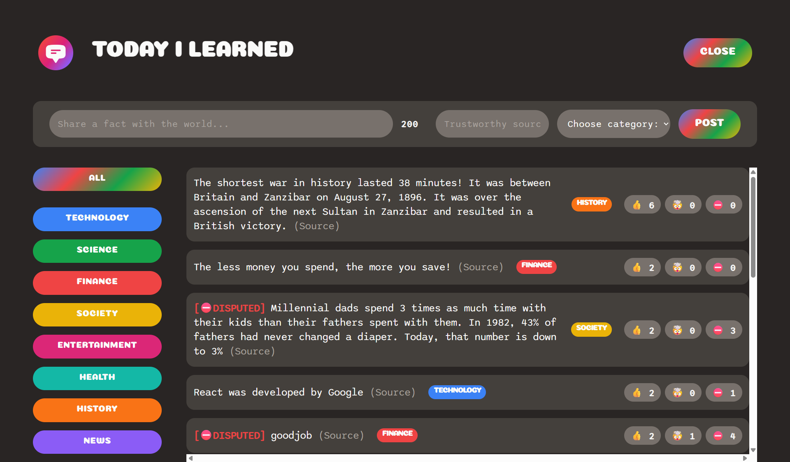

```markdown
# Short Quotes & Thoughts Share

A compact, interactive web application designed for sharing short quotes, thoughts, and statements with proper source referencing. Users can read posts and react to them using a unique community-driven content filtering system.

## 🚀 Features

- **Content Sharing:** Post brief thoughts or quotes along with their specific references.
- **Dynamic Reactions:** Users can react to any post using three distinct emojis: Like (👍), Brain Explode (🤯), and Prohibited (🚫).
- **Community Moderation System (`[DISPUTED]` Tag):** Features a built-in validation mechanism. If the combined total of **Likes** and **Brain Explodes** is strictly less than the number of **Prohibited** reactions, a `[DISPUTED]` tag automatically appears next to the post.
- **Categorized Filtering:** Effortlessly navigate through content using **8 distinct categories** to view only the topics you are interested in.

## 🛠️ Tech Stack

- **Frontend:** React
- **Backend/Database:** Supabase
- **Environment:** Node.js

---

## 💻 Getting Started

### Prerequisites

Before running this project locally, ensure you have **Node.js** installed on your system. For more detailed project specifications.
```

### Installation & Setup

Follow these quick steps to get the development environment running:

1. **Clone the repository**

```bash
git clone [https://github.com/m-khalvati/Today-i-Learned.git](https://github.com/m-khalvati/Today-i-Learned.git)
cd Today-i-Learned
```

2. **Install dependencies**
   Run the following command to download the required `node_modules`:

```bash
npm install

```

3. **Start the application**
   Launch the local development server:

```bash
npm start

```

Once the application is running, you can view it locally at:
👉 **http://localhost:3000**

---

## 📸 Preview & Screenshots

Here is a preview of the application user interface:

<div align="center">
  
</div>
